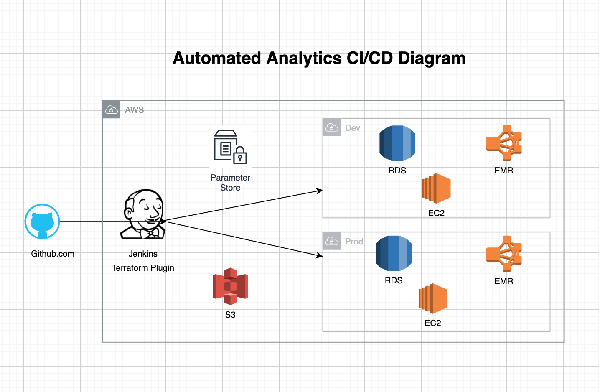

# Automated Analytics Infrastructure as Code

Contains terraform code to automatically stand up analytics environment in aws.

# Prerequisite
* Git
* Terraform >=0.12.23
* AWS Credential

## Getting started
1. clone this repository
2. `cd automated-analytics`
3. run `./run.sh init`
4. run `./run.sh apply`

## Usage
> `./run.sh <terraform action>`  
terraform actions: `init, plan, apply, destroy`

## Remove
> run `./run.sh destroy`

# Diagram

